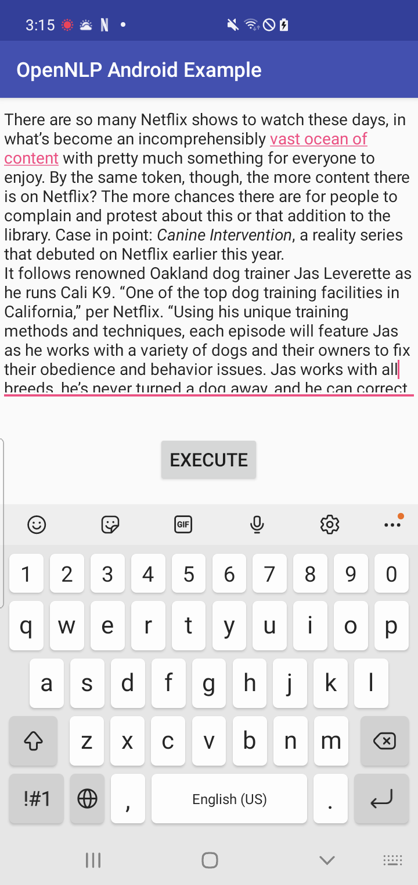
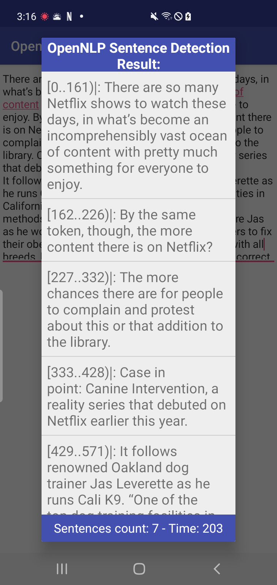

# OpenNLP Sentence Detection for Android Example
Using OpenNLP for Sentence Detection in Android example.

In natural language processing, deciding where is starting and ending points of a sentence in a paragraph is very important.
 
Here I use OpenNLP to extract the position of sentences in a paragraph. Sentence Detection depends on the language in the paragraph. In this example, I extracted sentence in English. We can change the model for other languages by downloading it [here](https://opennlp.apache.org/models.html)
 
Download and put the `.bin` file in asset folder.

First, Adding the following code in your `app/build.gradle` file to add openNLP library:

```groovy
    implementation group: 'org.apache.opennlp', name: 'opennlp-tools', version: '1.9.3'
```


Second, we need to load the model from asset folder

```jvm
        //Loading sentence detector model
        InputStream inputStream = null;
        SentenceModel model = null;
        
        try {
        
            inputStream = getAssets().open("en-sent.bin");
            model = new SentenceModel(inputStream);

        } catch (IOException e) {
            e.printStackTrace();
        }
```


Finally, we instantiating the `SentenceDetectorME` class and detect sentences from input text.

```jvm
        //Instantiating the SentenceDetectorME class
        SentenceDetectorME detector = new SentenceDetectorME(model);
        
        //Detecting the sentence
        sentences = detector.sentDetect(inputEt.getText().toString());
        sentencesIndex = detector.sentPosDetect(inputEt.getText().toString());
        }
```


# Screenshot
Copy the paragraph and paste in the InputText:



Click `EXECUTE` button and see result:


